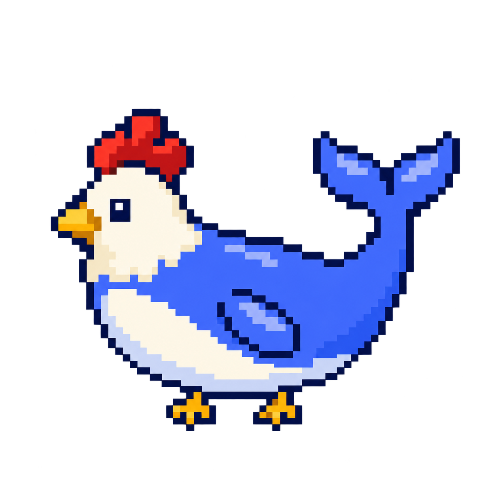
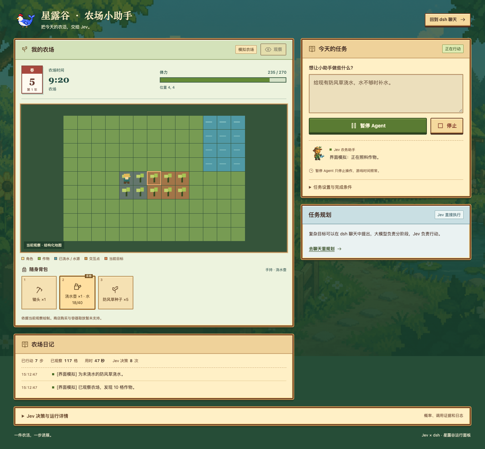

# agent-stardew · 星露谷农场小助手

<p align="center">
  
  <br>
  <strong>把今天的农活，交给 Jev。</strong>
</p>



*运行面板预览使用模拟农场数据；地图依据结构化观察绘制，不是游戏截图。*

基于 Jev 的星露谷 Agent。SMAPI Mod 与独立 CLI 提供游戏观察和动作，dsh 插件承载自主控制循环与运行面板。用户给一次目标，Jev 持续选择并执行下一步。

当前为可操作的开发版。已提供自主运行、动态候选、单步、暂停／继续／停止、运行记录和结果核验。完整真实游戏农务与自主补能力验收仍待完成，见[验证记录](docs/verification.md)。

复杂目标可在 dsh 聊天中按阶段规划：Jev 自主执行，阶段结果与受阻证据自动回到原聊天，后续阶段共享预算。默认只浇需要水的作物，并支持寻找水源给水壶补水。用法见 [dsh 操作说明](docs/dsh.md)。

## 开始今天的农活

安装 Node.js 22+、pnpm 和 dsh 后，运行 `pnpm install --frozen-lockfile`。在项目 `.env` 中填写 `OPENROUTER_API_KEY`，然后启动模拟农场：

```sh
pnpm start --mock --jev
```

启动后浏览器会打开登录入口。重新打开可运行 `pnpm open`；换浏览器或无痕窗口时，运行 `pnpm open --print` 获取当前登录链接，粘贴到首页的“启动链接”输入框并连接。登录页会提示链接过期或服务断开。

在 dsh 聊天右上角点击“农场小助手”，即可展开右侧面板；任务卡片中的“查看农场”打开同一个面板。也可独立打开 [Jev 运行面板](http://127.0.0.1:3080/stardew)。点击“观察”，输入目标并点击“开始农活”。不需要配置聊天模型。

> 在当前农场种下 1 颗防风草并浇水。完成后停止，不要睡觉。

面板展示随游戏观察更新的季节日历、农场时钟、体力条、背包槽位和农场日记。展开“Jev 决策与运行详情”可查看实际调用与动作概率。可直接暂停、继续或停止；单步位于“任务设置与完成条件”中。在其中填写作物 ID `24`、数量 `1` 并勾选浇水，让控制器按游戏状态验收；自由目标结束后会提示复核。

| 农活委托 | 完成条件 |
| --- | --- |
| 种下 1 颗防风草并浇水，不睡觉 | `cropId: "24"`、`cropCount: 1`、`watered: true` |
| 给 5 格现有作物浇水，缺水自行补水 | `wateredCrops: 5` |
| 找水源给水壶补水 | `refill: true`，核验水量增加，不等于补满 |

“已核验完成”表示指定条件通过；“待你复核”表示 Jev 建议结束，不能视为已核验。暂停 Agent 不会暂停游戏时间。

体验真实游戏时，先安装星露谷、SMAPI 和 .NET 6 SDK，正常保存并退出游戏后运行：

```sh
pnpm start --jev
```

此命令构建、备份并安装 Mod，启动 SMAPI 与 dsh。加载单人测试存档后即可回到运行面板，Mod 支持失焦后台运行，后台游戏时间会继续推进。自定义安装路径加 `--game-path "/游戏目录/Contents/MacOS"`。

当前支持探索、移动、农务、场景交互和对话。商店购买、容器取放等仍需补齐基础接口。新版 Mod 提供农务候选所需的土地和物品类型字段，源码更新后需要正常退出游戏再启动安装。

完整步骤见 [dsh 使用说明](docs/dsh.md)，架构与后续阶段见 [Jev 自主游玩设计](docs/jev-runtime.md)。

## 随包 Skill

项目维护一份 [stardew skill](packages/dsh-plugin/skills/stardew/SKILL.md)，安装 dsh 插件时自动注册，无需另装。它覆盖简单目标启动、复杂目标分阶段、暂停与接管、证据复核和受阻处理。聊天模型规划阶段，Jev 决定每一步，所有入口共享同一个游戏控制器。

在配置好聊天模型的 dsh 中输入：

> 读取 stardew skill。种下 5 颗防风草并浇水，然后回屋睡觉。按阶段规划，缺水自行补水，结束时告诉我实际完成了什么。

skill 与插件能力一起更新。修改源码后执行 `pnpm build:ts` 并重启 dsh；如果包含 Mod 更新，还需正常保存退出游戏，再运行 `pnpm start --jev`。`.env`、登录凭据、运行记录和存档备份保留在本机，不提交 Git。

## 从源码运行

需要 Node.js 22+、仓库指定的 pnpm，以及兼容的 dsh（当前验证 `0.1.5-rc.1`）。基础检查不需要游戏和模型 Key；Jev 自主游玩使用 OpenRouter Key；聊天入口的模型单独配置。

```sh
corepack enable
pnpm install --frozen-lockfile
pnpm check
pnpm run setup --mock
pnpm dev --mock
```

`setup` 创建本仓库 `work/dsh/` 下的独立 dsh 环境。`dev --mock` 启动模拟农场与 dsh Web UI，退出时关闭自己启动的进程。模拟结果明确标记为 `mock`。重复运行 setup 保留已有的 dsh 配置和会话。

另一个终端可以直接调用 CLI：

```sh
node packages/cli/dist/bin.js snapshot --endpoint ws://127.0.0.1:17655/
pnpm run doctor --mock
```

## 连接真实游戏

当前以 macOS、Stardew Valley 1.6.15、SMAPI 4.5.2 为编译基线。安装游戏和 SMAPI，准备 .NET 6 SDK，并在游戏关闭时运行：

```sh
pnpm run setup --game-path "/你的游戏目录/Contents/MacOS"
pnpm run doctor
pnpm dev
```

`setup` 编译并安装 Mod；已有同名 Mod 会先备份到 `work/backups/`。可用 `STARDEW_GAME_PATH`、`DOTNET_PATH` 和 `DSH_PATH` 指定依赖位置。用 SMAPI 启动游戏并加载专用测试存档后再执行游戏任务。游戏窗口需要正常刷新，渲染停滞时主线程动作也会超时。

实机农务验证使用专用存档和备份，不使用已有用户存档进行破坏性测试。`pnpm test:game` 仅记录真实游戏的只读快照，不等于通过完整任务验收。

## 检查与扩展

欢迎通过 Issue 和 Pull Request 参与开发。开始前请阅读[贡献指南](CONTRIBUTING.md)；新增基础动作需要同步协议、CLI、Mod、mock 和测试，模拟验证与真实游戏结果必须分别说明。

| 命令 | 用途 |
|---|---|
| `pnpm check` | 类型检查、构建、协议、CLI 与模拟农务测试 |
| `pnpm test:dsh` | 实际 dsh 工具注册器、构建产物、CLI 子进程与取消验证；不调用模型 |
| `pnpm test:login` | 当前 dsh 的真实鉴权与登录入口测试；先完成 setup |
| `pnpm test:mod` | C# 调度和网络队列测试；需要 .NET SDK，不需要游戏 |
| `pnpm build:mod` | 针对本机游戏与 SMAPI 编译 Mod |
| `pnpm test:package` | 打包并从 tarball 隔离安装，检查运行依赖、类型声明和 skill |
| `pnpm pack:release` | 在 `work/release/` 生成发行预览产物 |

- [CLI 操作说明](docs/cli.md)与 [dsh 使用说明](docs/dsh.md)。
- [研发与贡献体验](docs/developer-experience.md)：协议、技能与动作的扩展路径。
- [持续游玩与自主补能力](docs/self-improving-agent.md)：Agent 分工、候选验证、启用与恢复。
- [桌面安装与使用方案](docs/desktop-distribution.md)：普通用户安装包的后续计划。
- [素材清单](assets/visual/README.md)：像素鸡与蓝鲸主标识及配套插画。

源码边界：`packages/protocol` 定义协议，`packages/cli` 处理命令和连接，`packages/dsh-plugin` 注册工具与 skill，`mods/AgentStardew` 在游戏主线程执行操作。自主游玩循环由 dsh 插件内的 Jev 控制器持有。完整验收见 [SPEC.md](SPEC.md)。

本项目为非官方星露谷工具，采用 [MIT License](LICENSE)，需要自行安装 Stardew Valley 与 SMAPI。仓库不分发游戏本体、游戏资源或用户存档；配套像素插画的来源见[素材清单](assets/visual/README.md)。
