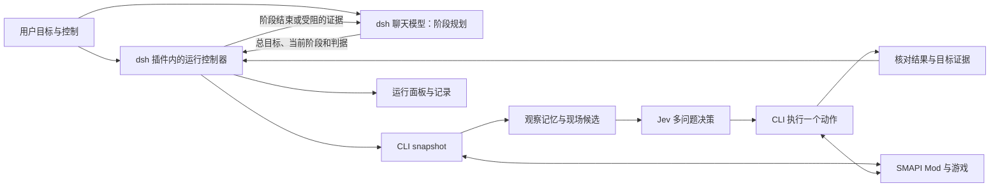

# Jev 自主游玩设计

用户给一次目标，由 Jev 持续决定游戏动作。现有 SMAPI Mod、协议和 CLI 负责观察与执行；dsh 插件承载控制器、运行面板与任务记录。正常游玩循环无需聊天模型参与。

控制循环与运行面板已实现；本文说明职责、边界与后续验收。当前操作步骤见 [dsh 使用说明](dsh.md)，游戏底座要求见 [SPEC](../SPEC.md)。

## 1. 用户怎样操作

启动 `pnpm start --jev`，在 dsh 同源的 `/stardew` 页面输入目标，例如“探索农场，找到可以种植的地方”。点击开始后，页面连续显示当前观察、Jev 选择和实际动作结果。面板直接调用控制器，不要求先配置聊天模型。

面板提供开始、单步、暂停 Agent、继续、停止和修改目标。修改目标先停稳当前操作，再递增任务修订、重新观察。普通操作无需逐步确认。dsh 对话入口负责按阶段规划复杂目标，阶段停稳后接收证据、判断是否继续，并汇总结果。

“暂停 Agent”停止决策和自动动作，并等待在途操作结束；游戏时钟是否继续单独显示。首版沿用游戏自身的时间规则。受控暂停游戏时间需要 Mod 提供独立、经过实测的能力，不能用停止角色移动冒充暂停游戏。

面板首屏只显示用户需要判断的信息：

| 区域 | 内容 |
| --- | --- |
| 任务 | 目标、运行状态、开始／暂停／继续／停止；预算与完成条件可展开设置 |
| 游戏 | 真实／模拟标记、地图、位置、时间、体力、背包、当前菜单 |
| 规划 | 阶段计划摘要、共享预算与 dsh 聊天入口 |
| 农场日记 | 行动步数、观察格数、用时、Jev 调用次数、动作结果与具体阻塞 |

实际模型、候选概率、请求耗时和完成证据收在“Jev 决策与运行详情”中。未观察时展示欢迎插画，观察后切换为结构化地图。界面中动作描述来自候选及执行结果；Jev 不生成自由文本解释。

## 2. 复用的基础与新增职责

| 层 | 保留或新增的职责 |
| --- | --- |
| Mod | 主线程观察、寻路、原子动作、资源与碰撞检查、动作完成证据 |
| 协议与 CLI | 共享 schema、目标引用、动作 ID、JSON 结果、超时与取消 |
| Jev 控制器 | 持有目标与预算，观察、生成候选、决策、执行、核验并持续循环 |
| dsh 插件 | 控制工具、同源面板、凭据解析、生命周期与会话关联 |
| dsh 聊天模型 | 可选的阶段规划、结果复核与受阻诊断；不参与每轮动作选择 |

控制器先放在现有 `packages/dsh-plugin/src/agent/` 中，通过注入的 CLI 调用接口访问游戏。控制算法不引用 dsh 会话对象或 HTTP 请求，因此可用模拟环境独立验证；本阶段无需增加独立服务或包。

## 3. 从游戏现场生成动作

候选生成器接收最新快照、已观察记忆和当前失败记录，输出具体、可执行的原子动作。用户目标交给 Jev 比较候选的价值；候选生成器负责判断操作是否有现场依据。

| 候选类别 | 来源与条件 |
| --- | --- |
| 移动／探索 | 已观察的可走格子、可达出口、能扩大观察范围的边界、通向已知对象的站位 |
| 选择物品 | 当前背包中的实际槽位、工具类型及物品数量 |
| 使用工具／种子 | 当前工具与相邻目标匹配，例如空置可耕地、空耕地、需要水的作物、可补水水源、可处理障碍 |
| 交互 | 已观察的门、床、NPC、对象和地图交互点；远处目标先生成靠近动作 |
| 菜单 | 当前菜单提供的实际选项；未支持菜单保留其类型与能力缺口 |

规则描述游戏动作的前提，不按“种五颗菜”等具体任务编排步骤。选择工具、移动、使用分别是一次决策；执行后读取新状态，再生成下一轮候选。

Mod 逐步补齐决定动作前提所需的机器字段，如 `diggable`、工具类型、种子类别和可交互类型。浇水根据 `needsWater` 生成，默认排除空耕地；`policy.allowEmptySoilWatering` 仅用于显式预浇目标。水源使用 `refillable`，水壶暴露当前水量与 `waterCapacity`；未满时可选择水壶、靠近水源再使用。Mod 调用游戏工具入口，等待动画并确认水量增加；不直接写入水量。显示名称用于展示；不能依赖中文物品名匹配核心规则。新字段与能力标记在协议、Mod、CLI 和模拟环境中同步更新；观察缺失时不猜测可执行性。

候选按操作类别分组，每组保留有代表性的目标，记录总数及是否截断。邻近可用目标、出口和不同方向的探索站位分别保留，避免土地格子挤掉全部探索选项。超过请求上限时分页观察或分组选择，不悄悄把未提供的选项当作不存在。

### 探索记忆

按本次游戏实例与存档加载代次，保存已观察格子、出口连接、重要对象、最近访问位置和动作结果。远处事实注明最后观察时间；历史引用不直接复用，行动前从当前快照重新取得引用。

对相同前提下失败的动作暂时排除，条件变化后允许重试。位置往返且没有新增观察、资源或目标进展时累积停滞计数，并让 Jev 看见相关记录。达到限额后给出具体阻塞，避免持续消耗调用。

## 4. Jev 直接决定下一步

继续使用 OpenRouter `~typesafe/jev-latest`，请求发往 `https://openrouter.ai/api/alpha/decisions`。每轮输入包含目标、当前观察、已确认的进展、近期行动和分组候选。

一个请求同时提出这些问题：

| 问题 | 输出 | 用途 |
| --- | --- | --- |
| `intent` | Choice | 选择探索、移动、选择物品、使用、交互、菜单、等待、申请结束或报告受阻 |
| `action_<类别>` | Choice | 假设采用该类别，选择其中最合适的具体动作 |

所有问题独立读取同一状态。程序先取 `intent`，再读取对应分支的动作，最多执行一个原子命令；其他分支答案不产生操作。意图概率与动作概率分别展示，不相乘为未经定义的“成功率”。

模型返回值必须满足当前问题和候选集合，概率为有限数、范围有效、总和合理。未知选择、无效结构、过期任务修订或取消后的响应都不能执行。低置信度时先刷新观察，在有限次数内重新判断；不能仅因多个合理探索方向概率接近就认定没有行动能力。

本轮完成后才发起下一轮。移动期间交由 Mod 寻路，抵达、失败或场景变化后再决策；不会每走一格重新请求模型。动画等待采用有上限的观察轮询。超时和限流使用有限退避，达到预算即停止并保留原因。

## 5. 控制生命周期与事实记录

一个游戏 endpoint 同时只允许一个活动控制器。控制器持有自己的取消信号和执行任务；HTTP 返回或一次聊天工具调用结束，不结束已经启动的游玩任务。

| 状态 | 含义与允许操作 |
| --- | --- |
| `idle` | 尚未启动，可输入目标和预算 |
| `running` | 持续观察、决策、执行，可请求暂停或停止 |
| `pausing` / `stopping` | 已禁止下一步，正在取消推理并等待 CLI／Mod 停稳 |
| `paused` | 保留目标与记忆，继续时先重新观察 |
| `stopped` | 本次运行结束，已发生的游戏变化保留 |
| `blocked` | 连接、能力、资源证据或预算阻止继续，展示具体原因 |
| `needs_review` | Jev 建议结束，但缺少足够的确定性完成证据 |
| `completed` | 任务要求的可观察判据全部通过 |

暂停和停止需要等待清理完成再返回对应终态。新目标不能与旧动作重叠。插件释放或 dsh 退出时取消请求、停止动作并写入最终记录。凭据只存在于服务端调用路径。

每个动作保留稳定的动作 ID、前后观察、Jev 请求与响应、所选分支、CLI 结果和任务修订。网络异常造成结果不确定时先查询与观察，不能用新的动作 ID 盲目重放消费操作。记录写入 `work/runs/<run-id>/`，当前状态原子更新，事件追加保存。

首版重启后可以查看记录；恢复执行需重新核对存档身份、位置、背包和任务进展。游戏运行记录不等于游戏持久存档。`instanceId` 和 `saveGeneration` 只足以识别当前加载，跨游戏重启恢复需增加稳定存档标识。

### 完成与能力缺口

有结构化判据的任务由代码核验，当前支持新种植作物及浇水证据、到达地图、新增观察格数、日期推进、本阶段实际浇水的作物格数和水壶补水。判据在每个阶段创建时指定，不能将前一阶段证据算作新完成的动作。

自由文本目标仍能启动。若无法转换为可靠判据，Jev 的结束选择记为 `needs_review` 并展示观察证据，不能直接宣称完成。农务验收需保留睡前种植与浇水证据，睡后核对日期，避免只检查次日土地状态。

缺失购买、容器等底层操作时，记录“当前目标需要什么、观察到了什么、实际接口缺什么”。自主开发流程消费这些证据；不会把重复提示模型视为已经补齐能力。后续开发与版本启用见[自主补能力方案](self-improving-agent.md)。

## 6. 大模型与 Jev 的阶段交接

`StagePlanner` 包装同一个控制器，维护总目标、所有者会话、阶段列表、共享请求预算和总时限。三个规划工具分别启动计划、接续当前结果、汇总计划。Jev 接收总目标与当前阶段，候选仍由观察和游戏规则生成。阶段之间携带旧地标，并在行动前刷新；存档身份必须一致。

只在 `completed`、`blocked` 或 `needs_review` 且动作停稳后交接。插件通知包含当前阶段及判据、环境来源、日期位置、背包、资源变化、失败记录、真实 Jev 请求信息和日志位置。大模型据此选择下一阶段或报告缺口；不逐动作轮询。统计“结果回传次数”，不把它冒充模型 API 请求次数。

接续必须匹配原会话对象、planId 和 previousRunId；每个结果只能接续一次。各阶段共享 Jev 次数预算，计划墙钟时限也包含大模型规划等待。手动控制解除接续关联，取消后的旧通知不能继续；会话释放时停止计划。总目标的 `model_completed` 表示聊天模型汇总，阶段的 `completed / VERIFIED` 才表示机器判据通过。

运行记录追加 plan 事件，包含目标、阶段与预算。重启保留证据，不自动恢复执行。购买、容器和未知菜单需要对应游戏接口；本轮不会自动生成并热加载 Mod。

## 7. 接入 dsh 的真实接口

已核对本机 dsh `0.1.5-rc.1` 源码：

| 接入点 | 实现依据与使用方式 |
| --- | --- |
| 控制工具 | `defineTool`、`ctx.tools.register`，注册 start、status、pause、resume、stop；工具与面板调用同一个控制器 |
| CLI 执行 | 复用 `ctx.subprocess.spawn` 的 argv、输出上限、信号和退出清理 |
| Web 面板 | `@deepseek-ai/dsh-host-webserver` 的 `webServer.register` 挂载 `/stardew` 及状态／控制接口，使用 disposer 注销 |
| 阶段交接 | `createUserMessage` 标记 plugin 来源；原 Agent 空闲时 `followup` 唤醒，忙时 `inject` 在下一步读取 |
| 生命周期 | Cordis effect 清理中等待控制器停稳；用户手动控制解除计划关联 |
| 凭据 | 复用 dsh credentials 或已有环境变量，在服务端解析 OpenRouter Key |

Web 能力作为可选宿主服务，命令行 profile 仍可注册控制工具。面板限定本机使用，控制请求校验来源与请求令牌；状态接口不返回凭据。接口返回 run ID、状态和错误码，客户端不解析自然语言判断是否启动成功。

需要显式说明：dsh 的普通聊天停止按钮只取消当前聊天调用；已启动的持续游玩任务通过面板或专用 stop 工具停止。若后续接入 dsh jobs，再按其任务归属和取消语义映射，不能把两套生命周期混为一谈。

## 8. 开发顺序与验收

| 阶段 | 代码交付 | 通过条件 |
| --- | --- | --- |
| J1：持续决策 | 改造 candidates、Jev client、memory，新增 runner；注册运行控制工具 | 一次启动后连续执行至少 20 次 Jev 决策，无聊天模型后续调用；取消后无新动作；实际请求证据齐全 |
| J2：可直接操作 | dsh 同源面板、开始／暂停／继续／停止、动态状态与错误、启动入口说明 | 不配置聊天模型也能输入目标运行；页面可看见实际模型、概率、结果和调用数 |
| J3：现场泛化 | 补齐必要观察字段、对象接近和交互、探索与停滞恢复、目标证据 | 换位置、槽位、已有进度后候选仍正确；能够选择未写任务攻略的探索目标；不重复同条件失败 |
| J4：实机交付 | 按真实轨迹补齐阻塞当前目标的最小基础动作，完成一次完整使用流程 | 专用备份存档中实际完成目标，分别记录模型行为、游戏动作与人工介入；后续再做重复成功率验收 |

首个可操作版本同时完成 J1、J2 和现有动作范围内的 J3。商店、容器等新能力按真实目标的阻塞顺序交付；界面如实显示当前能力范围。SPEC 中的五次农务验收继续保留为后续稳定性标准。

关键验证集中在跨步骤的实际约束：停止与启动竞争、取消推理后的迟到响应、菜单切换与旧引用、状态变化后的失败重试、任务修订隔离、模型完成判断与游戏证据的区别。模拟协议与模型替身验证控制逻辑；真实 Jev 调用及真实游戏结果分别记录。

参考实现：[StarCraft 控制循环](https://github.com/phyous/tsai-sc/blob/main/tsai_sc/run.py)、[Browser Use 动态候选](https://github.com/browser-use/jev-ultrafast/blob/main/jev_ultrafast/model.py)、[TypeSafe 多问题并行](https://docs.typesafe.ai/patterns/fan-out)。本项目沿用自己的游戏基建。
